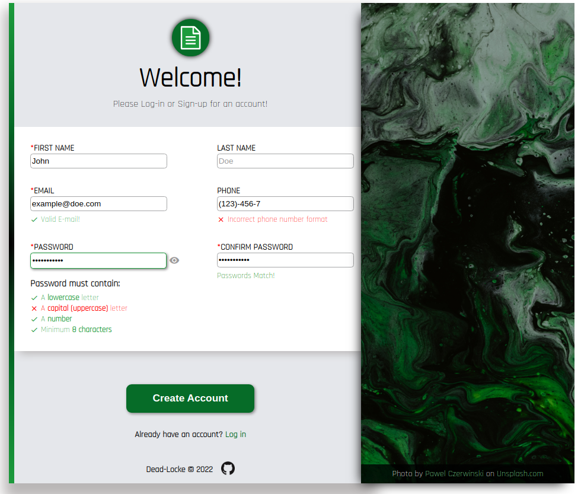

# Sign-Up Form
## Fourth major project from the [Odin Project](https://www.theodinproject.com/lessons/node-path-intermediate-html-and-css-sign-up-form) carriculum.
---

### [Live Version](https://dead-locke.github.io/sign-up-form/)
---
This is a basic sign-up form for the [Odin Project Carriculum](https://www.theodinproject.com/lessons/node-path-intermediate-html-and-css-sign-up-form) that includes client-side valdiation and password matching validation.

### Goals/Features:
- [x] Mark clearly required input fields
- [x] Placeholder text within input fields to serve as examples for user input. 
- [x] Basic form validation through HTML RegEx pattern requirements.
- [x] Client-side password, email and phone number validation with JavaScript. 
- [x] A custom validation message as the user enters their password. 
- [x] Client-side password field matching validation with JavaScript with error message. 
- [x] Custom error messages accompany all client-side validated fields.
- [x] Password visibility toggle. 

---

### Learning Outcomes: 
- Learned how to structure a basic form and best orientation practices. 
- Learned that short forms are often better at acomplishing their goals, and asking for unnecessary information is detrimental to user experience and user retention.  
- Learned about form elements and how to properly use them for basic validation and restriction of user input. 
- Learned basic regex pattern matching.
- Learned about form design principles regarding user feedback during validation, specifically the importance of consistent, immediate feedback during data entry. 

- Learned how to use Java-Script to implement basic Client-Side validation. 
- For some reason, functions  called within addEventListener need to be nested within an anonymous function if those functions have any arguments passed into them. 

---
### Future features:
- [ ] Make the page more responsive. 
- [ ] Add min/max length validation with responsive error messages.
- [ ] Support for international phone number formats. 